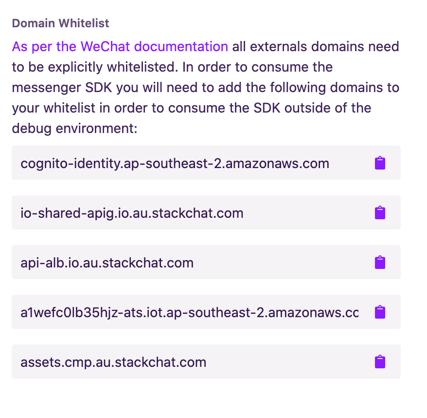

# Stackchat Mini Program Messenger

The official Stackchat Mini Program SDK.

# Description
The MP Messenger allows developers to easily add the stackchat messenger client to a mini program and supports the same features that are available on the web messenger version.

## Installation
In order to install the messenger client into your project you will need to clone or download the source code from this repository and copy across the messenger and npm directory into your project. If you are simply including the project into the main bundle then the directories need to be added at a top level in order for them to correctly resolve their dependencies. There are some example below of how to include the messenger as it's own tab within your application or as a subPackage.

```
/src
  /pages
  /messenger <-- Top level
  /npm <-- Top level
  app.js
  app.json
```

## Mini-Program Domain Whitelisting
[As per the documentation](https://developers.weixin.qq.com/miniprogram/dev/framework/ability/network.html) all externals domains need to be explicitly whitelisted, in order to consume the messenger SDK you will need to add the following domains to your whitelist in order to consume the SDK outside of the debug environment.

You can find the domains you need to add to your mini-program white-list by visiting the 'mini-program' integration maangement panel within the Stackchat Studio. An example of this will look as follows:



### Messenger as a tab page.

#### Example

To add the widget as a new tab you can do the following:
```
// Create a new page
/src
  /pages
    /chat-tab
      chat-tab.js
      chat-tab.json
      chat-tab.wxml
      chat-tab.wxss
```

```xml
<!-- chat-tab.wxml -->
<block><messenger></messenger></block>
```

```json
// chat-tab.json
{
  "usingComponents": {
    "messenger": "../../messenger/Messenger"
  }
}
```

```json
// app.json
{
  "pages": [
    "pages/index/index", // Your pages
    "pages/chat-tab/chat-tab", // The chat page
    "messenger/pages/webview/webview" // Webview
  ],
  "tabBar": {
    "color": "#666",
    "selectedColor": "#b4282d",
    "backgroundColor": "#fafafa",
    "borderStyle": "black",
    "list": [
      {
        "pagePath": "pages/index/index",
        "text": "home"
      },
      {
        "pagePath": "pages/chat-tab/chat-tab",
        "text": "chat"
      }
    ]
  }
}
```

### Messenger as a subPackage
If you would like to split the messenger out of the main package of you app in order to keep the file size small, you can easily split out the code into a subpackage. Before you do this however make sure that you [understand the limitations of sub packages within the mini program ecosystem]("https://developers.weixin.qq.com/miniprogram/en/dev/framework/subpackages.html")

#### Layout
Your subpackage contents should be laid out following these conventions.
```
/stackchat-messenger
  /messenger
  /npm
  index.js
  index.json
  index.wxml
```
The `index.json` and `index.wxml` files should look as follows:

```json
// index.json
{
  "usingComponents": {
    "messenger": "./messenger/Messenger"
  }
}
```

```xml
<!-- index.wxml -->
<block><messenger></messenger></block>
```

#### Subpackage Application Config
Add the following configuration options to your package folder.
```json
//app.json
{
  "subpackages": [
    {
      "root": "pages/stackchat", // This should be the subpackage directory relative to your app root.
      "name": "messenger",
      "pages": [
        "index",
        "messenger/pages/webview/webview",
        "messenger/Messenger"
      ]
    }
  ],
  "preloadRule": { // Only add this if you want to preload the messenger.
    "preloadRule": {
    "pages/my/index": {
      "packages": ["messenger"]
    }
  }
}
```

## App Configuration
The client is able of generating webviews based on content it receives from the conversation author, in order to load webviews you will need to ensure that the `urlCheck` flag is set to false in your `project.config.json` file.

#### Example
```json
// project.config.json
{
  "miniprogramRoot": "./",
  "projectname": <project-name>,
  "description": <description>,
  "appid": <id>,
  "setting": {
    "urlCheck": false, <-- Must be false
    "es6": false,
    "postcss": false,
    "minified": false
  },
  "compileType": "miniprogram"
}
```

## Messenger Client Page
The messenger client will occupy the entirety of the page it is added to, since mini programs don't allow ui components to persist between pages we strongly recommend that you add the web client as a tab to your program, you can add it as a page, however when you want to open the chat widget you will need to create a link to navigate to that page.

Finally we need to register our page inside of the app and the webview page in order to have them render correctly. Here is an example setup of the chat-tab.

## Messenger Configuration
The fullset of configuration options avaialble to the messenger can be seen on the web-messenger project page which can be found here

In order to configure the messenger you will need to add a `stackchat` property to the top level of your `app.json` file.

```json
  stackchat = {
    appId: "<your-appid>",
    customColors: {
      actionColor: "4c0099",
      brandColor: "4c0099",
      conversationColor: "4c0099"
    },
    locale: "zh_CN",
    region: "cn"
  }
```

## API
The mini program API that is exposed to consumers is the same API that is available in the web-messenger version of this SDK there are however some implementation differences.

Due to the way mini programs work we are unable to garuntee API availability at runtime, pages in a mini program are not made available until they are loaded and since many of the API methods are only available after init which happens when the messenger page is loaded, consumers need to be careful to perform a runtime check that a messenger instance is running before they begin calling public methods which require it. To do this we have provided the convenience method `isInitialized()` to check that the messenger has loaded, in conjunction with this there exists an event system which can listen for the `'ready'` event to check when the messenger API is available, it can be consumed as follows.

```javascript
import { on, simulateMessage } from "./messenger";

on("ready", function () {
  simulateMessage("Hello World!");
});
```

Likewise because we can't garuntee that the files will be available imediately on app load we have exposed the public API through explicit imports, instead of searching for a global `stackchat` object from which to call the convenience methods, consumers should import public methods directly from the SDK.

Example:

```javascript
import { setDelegate } from "../messenger";
```

#### sendMessage(message)
Sends a message on the user's behalf

```javascript
import { sendMessage } from "../messenger";
sendMessage({
    type: 'text',
    text: 'hello'
});

// OR

sendMessage('hello');
```

#### getConversation()
Returns the conversation if it exists

```javascript
import { getConversation } from "../messenger";
var conversation = getConversation();
```

#### setPredefinedMessage(message)
Prefills the user's chat input with a predefined message.

```javascript
import { setPrefedinedMessage } from "../messenger";
setPredefinedMessage(message);
```

#### simulateMessage(message, ?avatar)
Simulates a message to the client without ever sending one to the server, these messages will not be persisted between sessions.

Takes in an optional second parameter for displaying an avatar associated with the message, this will default to gravatar's empty gray user icon if left blank.
```javascript
import { simulateMessage } from "../messenger"; 
simulateMessage(message);
```

#### triggerPostback(payload, metadata)
Manually trigger a postback message on the users behalf.

```javascript
stackchat.triggerPostback(payload, metadata).then(() => {
    console.log("postback sent")
})
```

#### setDelegate(delegate)
Sets a delegate on the conversation. See the [delegate](#delegate) section for more details.

```javascript
import { setDelegate } from "../messenger";
setDelegate(delegate);
```

### Delegate
stackchat allows you to set a delegate to receive callbacks when important changes happen in the conversation.
To set a delegate, use the [setDelegate](#setdelegatedelegate) method.

#### beforeDisplay
The `beforeDisplay` delegate allows a message to be hidden or modified before it is displayed in the conversation. This delegate should return a falsy value such as `null` to hide the message. It can also return a modified message object in order to change what the user will see rendered in their conversation history. Note that this change affects the client side rendering only; the server side copy of this message can not be modified by this delegate.

```javascript
import { setDelegate } from "../messenger";
setDelegate({
  beforeDisplay(message) {
      if (message.metadata && message.metadata.isHidden) {
          return null;
      }

      return message;
  }
});
```

#### beforeSend
The `beforeSend` delegate method allows you to modify properties of a message before sending it to stackchat.
The modified message must be returned for it to take effect.

```javascript
import { setDelegate } from "../messenger";
setDelegate({
  beforeSend(message) {
    message.metadata = {
        any: 'info'
    };

    return message;
  }
});
```

#### beforePostbackSend
The `beforePostbackSend` delegate method allows you to modify properties of a postback before sending it to stackchat.
The modified postback must be returned for it to take effect.

```javascript
import { setDelegate } from "../messenger";
setDelegate({
  beforePostbackSend(postback) {
    postback.metadata = {
        any: 'info'
    };

    return postback;
  }
});
```

### Events
To bind an event, use `stackchat.on(<event name>, <handler>);`. To unbind events, you can either call `stackchat.off(<event name>, handler)` to remove one specific handler, call `stackchat.off(<event name>)` to remove all handlers for an event, or call `stackchat.off()` to unbind all handlers.

#### ready

```javascript
// This event triggers when init completes successfully... Be sure to bind before calling init!
stackchat.on('ready', function(){
    console.log('the init has completed!');
});
```

#### message:received
```javascript
import { on } from "../messenger";
// This event triggers when the user receives a message
on('message:received', function(message) {
    console.log('the user received a message', message);
});
```

#### message:sent
```javascript
import { on } from "../messenger";
// This event triggers when the user sends a message
on('message:sent', function(message) {
    console.log('the user sent a message', message);
});
```

#### message
```javascript
import { on } from "../messenger";
// This event triggers when a message was added to the conversation
on('message', function(message) {
    console.log('a message was added to the conversation', message);
});
```
